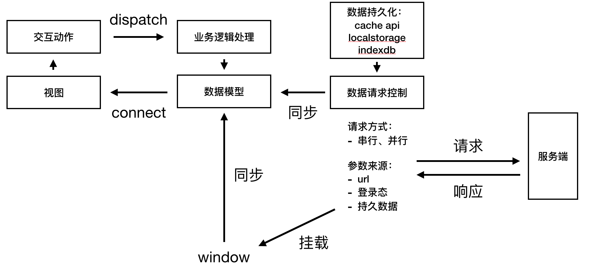
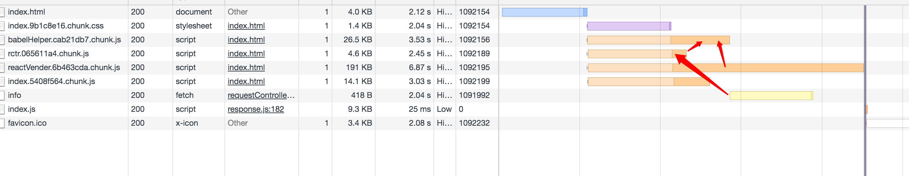

## 介绍

- 雏形，目的是实现前端分层架构
- 框架组成
   - 视图层
   - 逻辑层：生命周期，中间件，事件，副作用，状态管理，路由，导航
   - 请求层：缓存持久化，错误处理，请求，数据存储，预请求，sw fetch
   - 构建工具：命令 cli，spa，mpa，ssr

## 简约架构图

## 首屏接口预请求

- 多入口打包
- 预请求包加载提前，预框架、首屏资源等并行请求，在资源加载完成前完成首屏数据请求
